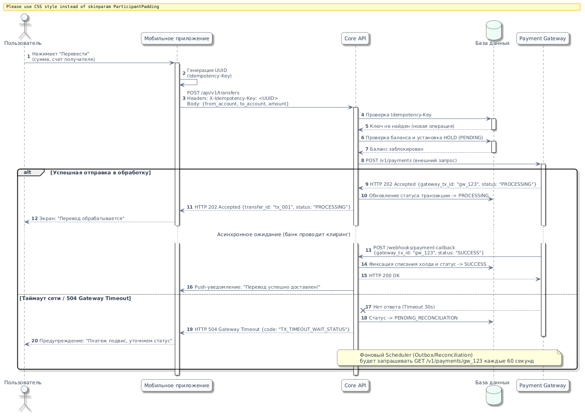
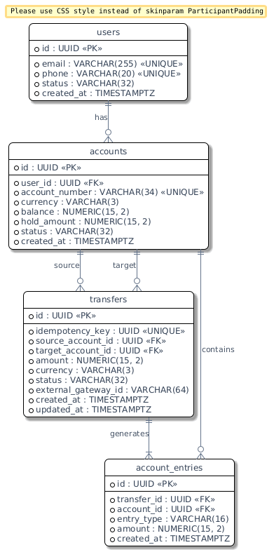

# P2P Transfer & Payment Gateway Integration (Core Banking)

Архитектурная спецификация и системное проектирование сервиса мгновенных переводов денежных средств между счетами с интеграцией внешнего платежного шлюза.

---

## 1. Бизнес-контекст и проблематика

Сервис обеспечивает проведение транзакций между счетами клиентов.
* **Ключевой вызов:** Обеспечение строгой консистентности балансов (ACID) и защита от дублирования списаний в условиях нестабильной сети (таймауты сторонних сервисов, повторные клики пользователей, состояние гонки).
* **Архитектурный подход:** 
  * Асинхронный клиринг (`HTTP 202 Accepted` + `Webhook`).
  * Механизм идемпотентности на базе UUID (`X-Idempotency-Key`).
  * Двухфазное списание (Hold $\rightarrow$ Capture).
  * Транзакционный финансовый леджер (бухгалтерский учет методом двойной записи).

---

## 2. Сценарий интеграции (Sequence Diagram)

Взаимодействие клиентского приложения, банковского ядра (Core API), реляционной СУБД и внешнего платежного шлюза.

### Ключевые архитектурные решения:
1. **Идемпотентность запросов:** Клиент генерирует заголовок `X-Idempotency-Key` (UUID) перед отправкой. Повторный вызов с идентичным ключом не создает новую транзакцию, а возвращает текущий статус операции.
2. **Двухфазный клиринг (Hold):** Средства замораживаются (`hold_amount`) со статусом `PENDING`. Окончательное списание происходит только при получении подтверждения от внешнего банка (`SUCCESS`).
3. **Отказоустойчивость (Fault Tolerance):** При обрыве соединения или `HTTP 504` операция переводится в статус сверки (`PENDING_RECONCILIATION`), после чего фоновый планировщик (Outbox / Reconciliation Worker) опрашивает API шлюза (`GET /v1/payments/{id}`).

---

## 3. Контракт API (OpenAPI 3.0)

Спецификация публичного интерфейса доступна в файле: [`contracts/transfer-openapi.yaml`](contracts/transfer-openapi.yaml).

* **Эндпоинт:** `POST /api/v1/transfers`
* **Обязательные заголовки:** `X-Idempotency-Key` (UUID)
* **Семантика статус-кодов:**
  * `202 Accepted` — перевод принят и находится в обработке (асинхронное исполнение).
  * `400 Bad Request` — синтаксическая ошибка JSON или невалидные типы полей.
  * `409 Conflict` — конфликт ключа идемпотентности (запрос с таким ключом уже обрабатывается с другими параметрами).
  * `422 Unprocessable Entity` — семантическая/бизнес-ошибка (недостаточно средств, счет заблокирован).

---

## 4. Модель данных (ERD) и транзакционный учет

Схема базы данных PostgreSQL спроектирована с учетом третьей нормальной формы (3NF) и паттерна бухгалтерского леджера.

* **DDL-схема:** [`db/schema.sql`](db/schema.sql)
* **Транзакционные и аналитические сценарии:** [`db/queries.sql`](db/queries.sql)

### Особенности проектирования БД:
* **Защита от Race Condition:** При списании средств используется пессимистичная блокировка строк (`SELECT ... FOR UPDATE`) с упорядочиванием по идентификаторам счетов для предотвращения взаимных блокировок (Deadlocks).
* **Бухгалтерский леджер (`account_entries`):** Баланс счета всегда подтверждается суммой атомарных проводок (`HOLD`, `DEBIT`, `CREDIT`).
* **Контроль целостности (Constraints):**
  * `transfers.idempotency_key` — `UNIQUE` для предотвращения дублей на уровне СУБД.
  * `accounts.balance` и `accounts.hold_amount` — ограничения `CHECK (balance >= hold_amount)` и `CHECK (balance >= 0)`.